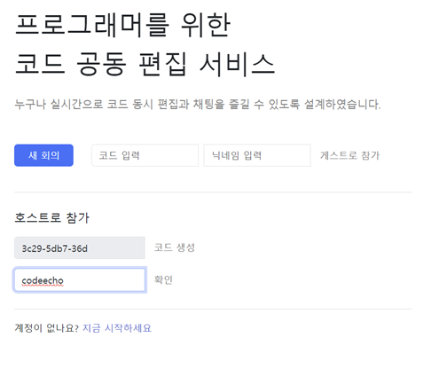
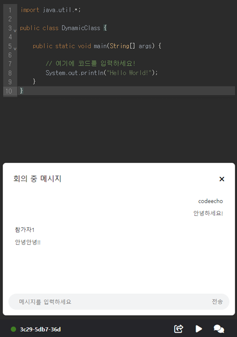
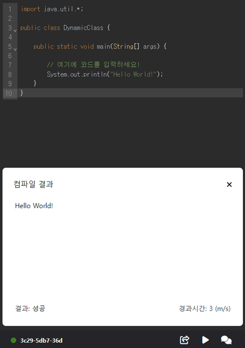
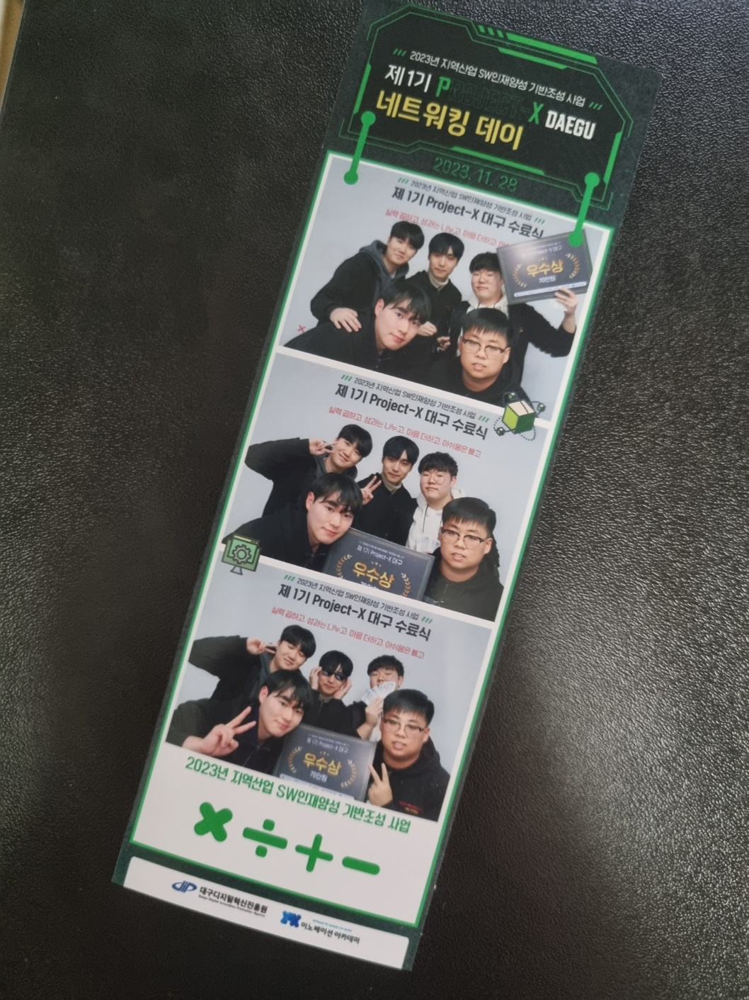

# 🌐 CODE-ECHO

1. 코드 공유 :
   - 사용자가 작성한 코드를 실시간으로 다른 사용자와 공유할 수 있습니다.
   - 공유된 코드는 실시간으로 업데이트 되며, 모든 참여자에게 동시에 표시됩니다.
2. 실시간 협업:
   - 여러 사용자가 동시에 코드를 편집할 수 있어야 하며, 이러한 변경 사항은 실시간으로 모든 참여자에게 동기화 됩니다.
   - 사용자 간 채팅이나 코멘트를 통해 의사소통이 가능하게 됩니다.
3. 사용자 초대:
   - 초대하고 싶은 사용자를 회의실에 초대하여 협업이 가능합니다.

### Skiils

- FE: HTML, CSS, JS
- BE: Spring boot
- Tools: [CodeMirror](https://codemirror.net/), [Yorkie](https://yorkie.dev/)

### Result

- [발표자료](./data/presentation.pdf)
- [최종보고서](./data/final-report.pdf)
- 실행 결과물

<p align="center">
    
</p>

<p align="center">
    
    
</p>

&nbsp;

# 🏃🏻‍♂️ How to run

<details>
<summary><b>자세히보기</b></summary>
<div markdown="1">

### 1. EC2 생성

### 2. [yorkie 라이브러리 설치](https://github.com/yorkie-team/yorkie-js-sdk)

```bash
git clone https://github.com/yorkie-team/yorkie-js-sdk.git
```

### 3. Docker, JDK, yorkie 설치

```bash
#[도커설치]
sudo apt update
sudo apt install apt-transport-https ca-certificates curl software-properties-common
curl -fsSL https://download.docker.com/linux/ubuntu/gpg | sudo apt-key add -
sudo add-apt-repository "deb [arch=amd64] https://download.docker.com/linux/ubuntu focal stable"
sudo apt update
sudo apt install docker-ce
sudo apt install docker-compose

#[MariaDB 설치]
sudo apt-get update
sudo apt install mariadb-server
sudo apt-get install mariadb-client
sudo mysql_secure_installation
sudo mysql -uroot -p

#[JDK17 설치]
sudo apt update
sudo apt install openjdk-17-jdk
java -version

#[yorkie]
docker-compose -f docker/docker-compose.yml up --build -d

#[gradlew]
sudo chmod +x ./gradlew

#[run]
cd build/libs/{.jar}clcl

#[포트포워딩]
iptables -A PREROUTING -t nat -i eth0 -p tcp --dport 80 -j REDIRECT --to-port 8080
```

</div>
</details>

&nbsp;

# 🏆 Awards

- 2023년 지역산업 SW인재양성 기반조성 사업
- 제 1기 PROJECT-X 대구 "우수상"

<p align="center">
    
    
</p>
